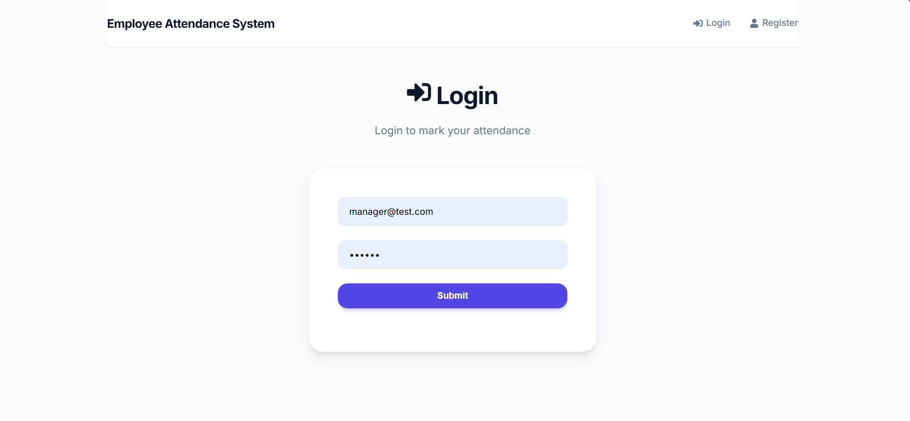
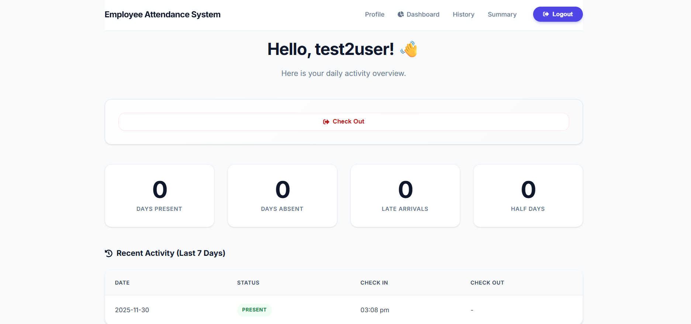
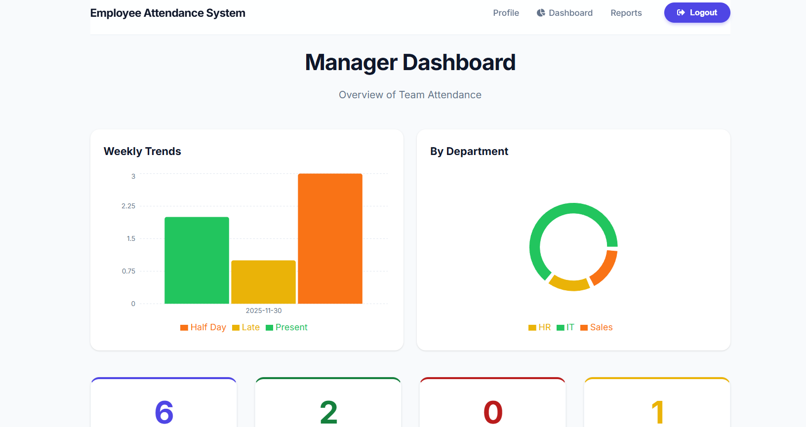
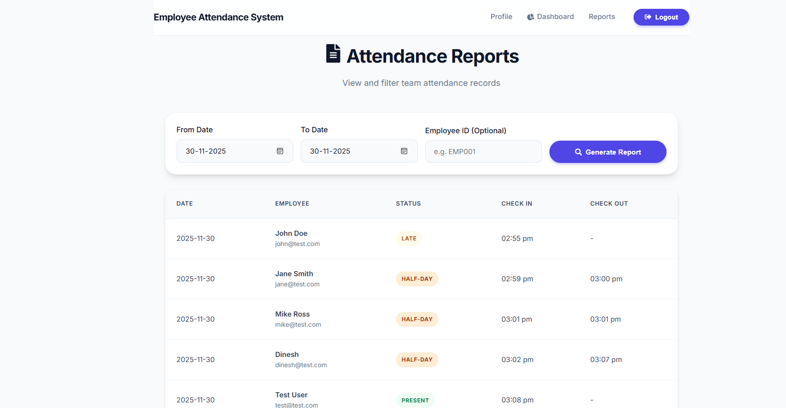
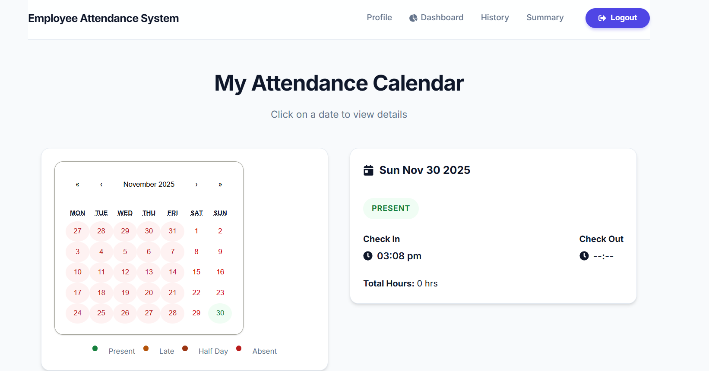

# Employee Attendance System

A full-stack MERN application for tracking employee attendance, calculating work hours (Late/Half-day logic), and generating CSV reports for managers.

## 🚀 Features
- **Employee:** - Mark Attendance (Check In/Out).
  - View Attendance History (Calendar View).
  - View Monthly Summary.
- **Manager:** - Dashboard with Charts (Weekly Trends, Department Stats).
  - View "Who is Absent Today".
  - Export Attendance Reports to CSV.

## 🛠️ Tech Stack
- **Frontend:** React, Redux Toolkit, Recharts, CSS Modules.
- **Backend:** Node.js, Express, MongoDB.
- **Database:** MongoDB Atlas / Local.

## ⚙️ How to Run Locally

1. **Install Dependencies**
   ```bash
   # Root
   npm install
   
   # Backend
   cd backend
   npm install

   # Frontend
   cd ../frontend
   npm install


   Login Page

   

   Employee Dashboard

   

   Manager Dashboard

   

   Attendance Reports & Calendar

   

   